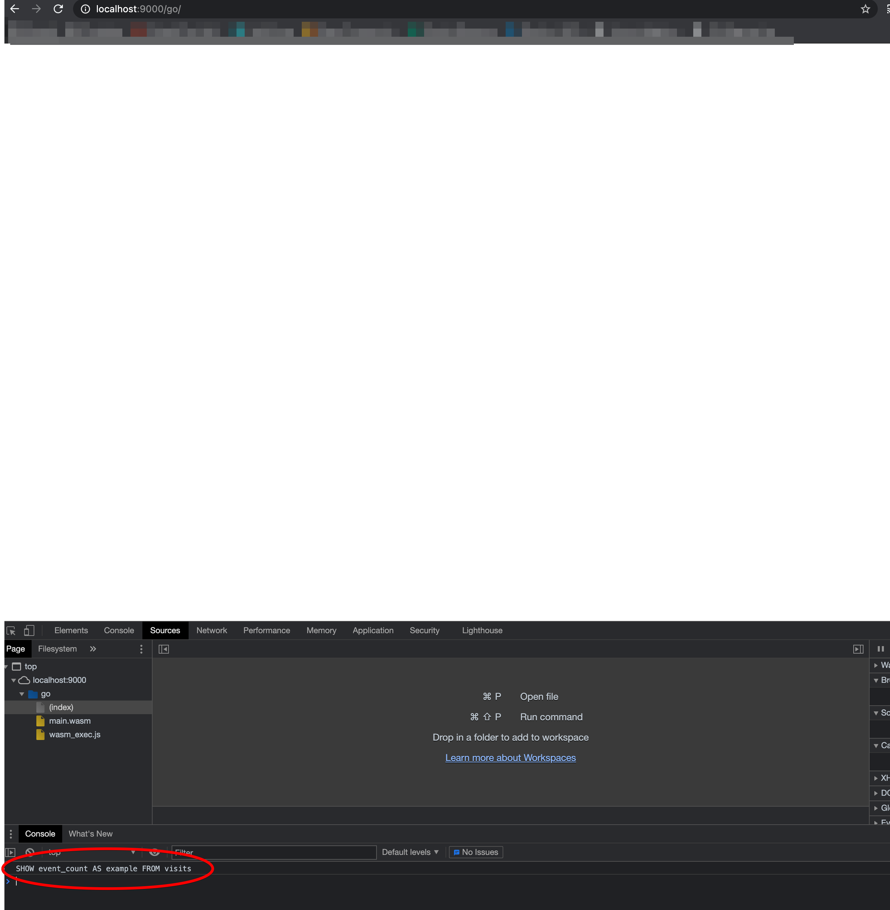
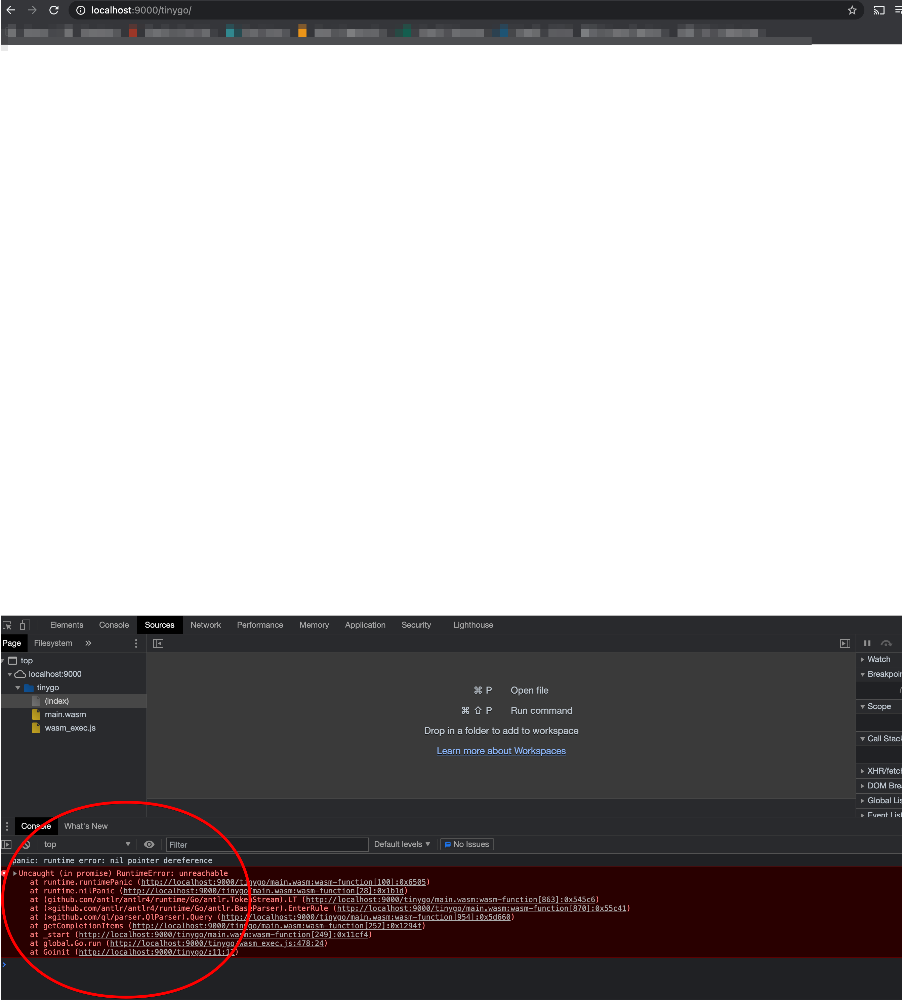

# Getting Started

## Building package with Go

```
 $ GOARCH=wasm GOOS=js go build -o public/main.wasm main.go
```

## Building package with tinyGo

```
 $ tinygo build  --no-debug  -o public/main.wasm -target wasm main.go
```

## Executing the Go compile version in the browser

Instaling goexec

```
$ go get -u github.com/shurcooL/goexec

```

Builing both wasm files
```
# TinyGo
$ ~/src/github.com/tinygo-org/tinygo/tinygo build  --no-debug  -o public/tinygo/main.wasm -target wasm main.go

# Go
$ GOOS=js GOARCH=wasm go build -o public/go/main.wasm main.go
```

Coping wasm_exec.js files

```
#tinyGo
$ cp $(~/src/github.com/tinygo-org/tinygo/tinygo env TINYGOROOT)/targets/wasm_exec.js public/tinygo

# Go
$ cp "$(go env GOROOT)/misc/wasm/wasm_exec.js" public/go
```

Running web-server:

```
$ goexec 'http.ListenAndServe(":9000", http.FileServer(http.Dir("./public")))'
```

## Expected results

### Go

Visit: [http://localhost:9000/go/](http://localhost:9000/go/)




### TinyGo

Visit: [http://localhost:9000/tinygo/](http://localhost:9000/tinygo/)




